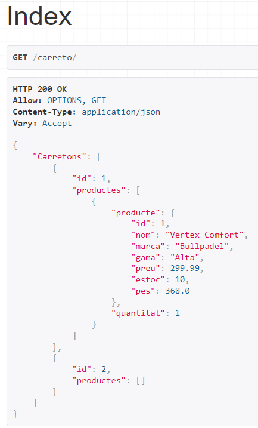
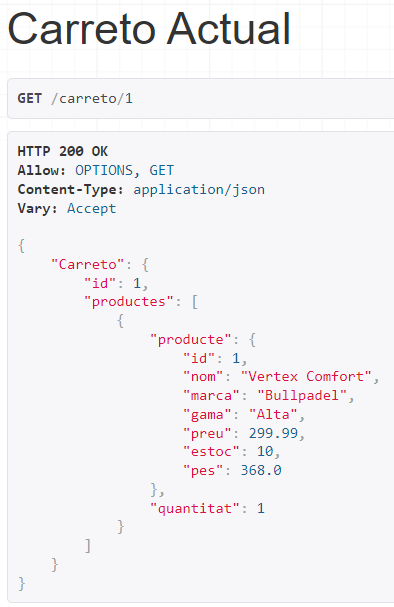
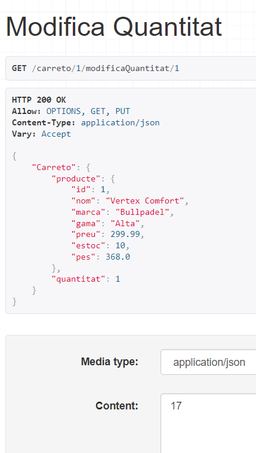
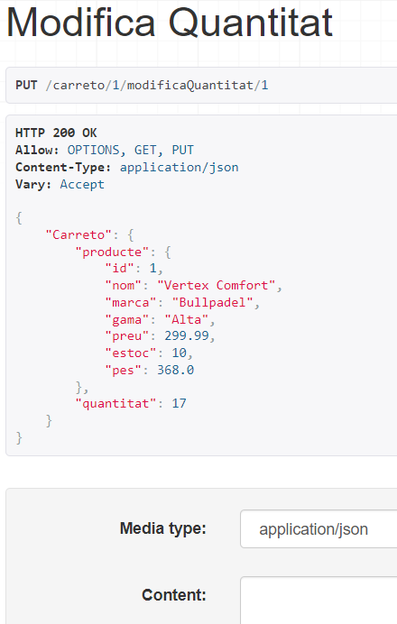
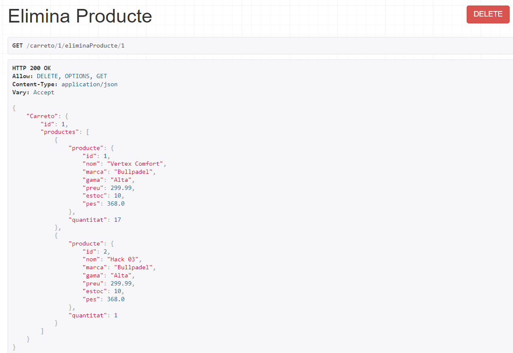
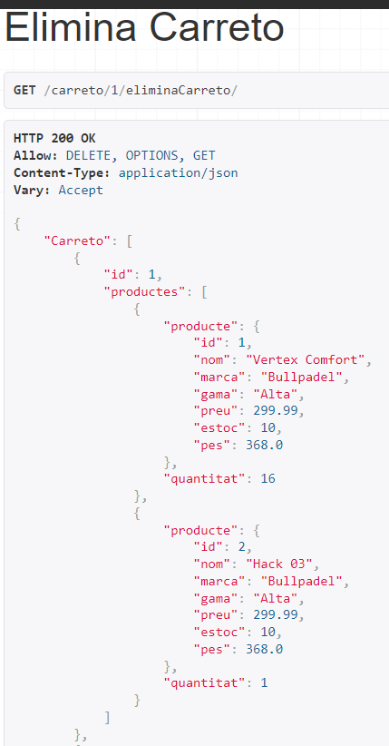
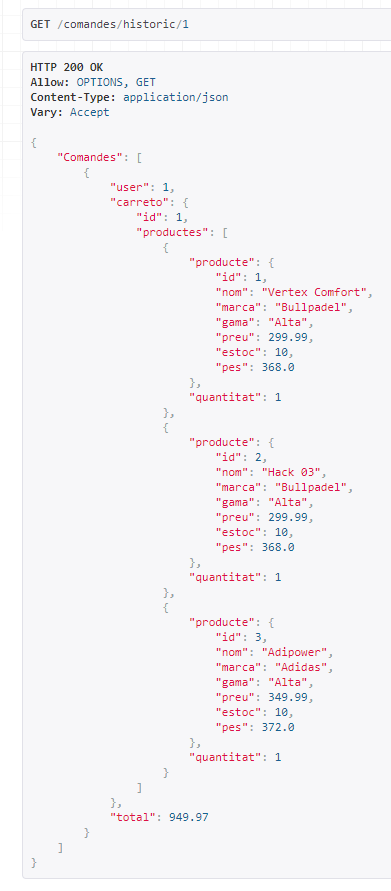
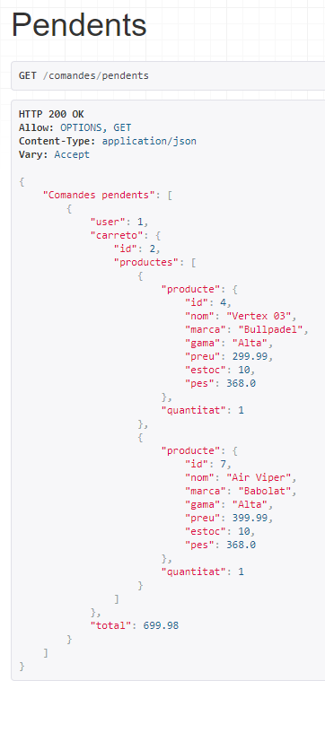

# M07_UF4_P5_Tenda

## Catàleg

Pàgina principal dels catàlegs (**/cataleg**):

Pàgina d'un catàleg (**/cataleg/1**):

Pàgina per afegir un producte (**/cataleg/1/afegir**):

Després d'afegir els productes

Contingut (ID del producte):

Pàgina per eliminar un producte (**/cataleg/1/eliminar/2**):

Després d'eliminar el producte amb ID 2:

Pàgina per editar un producte (**/cataleg/1/editar/2**):

Després d'editar el producte amb ID 2:

Contingut (Key, Value):

## Carreto

Index carretons (**/carreto**):

Mostrem un carreto (carretoActual) (**/carreto/1**):

Afegim un producte al carreto (**/carreto/1/afegeixProducte**):

Resultat:

Modifiquem la quantiat d'un producte (**/carreto/1/modificaQuantitat/1**):

Resultat:

Eliminem un producte del carreto (**/carreto/1/eliminaProducte/1**):

Resultat:

Eliminem el carreto sencer (**/carreto/1/eliminaCarreto**):

Resultat:

## Comandes

Mostra les comandes pagades (**/comandes/historic**):

Mostra les comandes pendents (sense pagar) (**/comandes/pendents**):

## Pagaments

Abans de pagar un carretó (**/pagaments/carreto/1**):

Dades tarjeta correcte:

Resultat:

Dades tarjeta incorrecte:

Resultat:

Carretó ja pagat:

